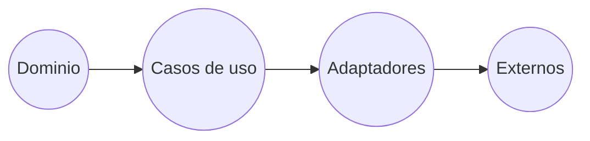

# Clean Architecture

## Que es?

Forma de estructurar un proyecto para cumplir un objetivo

## Estructura

### Dominio

- Lógica de negocio
- Entidades => Usuarios
- Inmutables
- Regla que no esta limitada tecnicamente

### Casos de uso

- Lógica de aplicación => Limitado a la tecnología
- Debe poder acercar a una entidad con una regla de negocio del dominio

### Adaptadores

- Se comunica con la parte interna y externa
- Parecido a un middleware
- El DOM nos permite comunicarnos con el navegador

### Externos

- Recurso dentro de la aplicación que en un momento dado se puede intercambiar
- No es nuestro
- El FrontEnd y BackEnd esta presente en esta capa
- Base de datos es intercambiable y es manejada mediante un adaptador
- El navegador es externo
