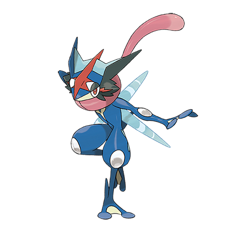
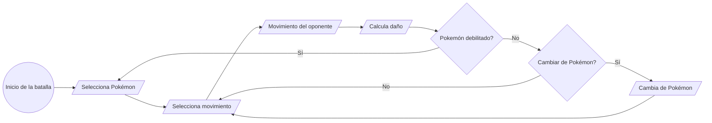
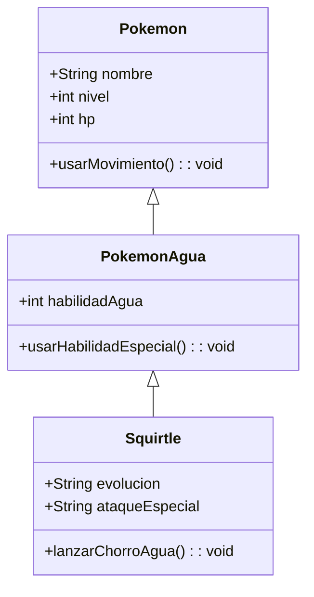
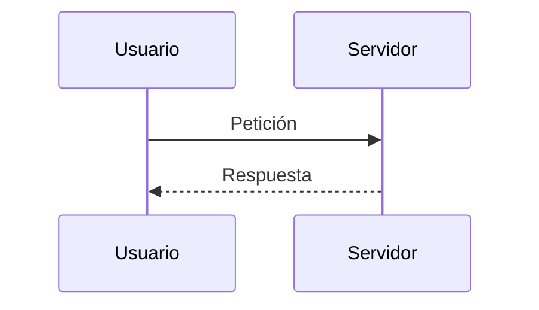
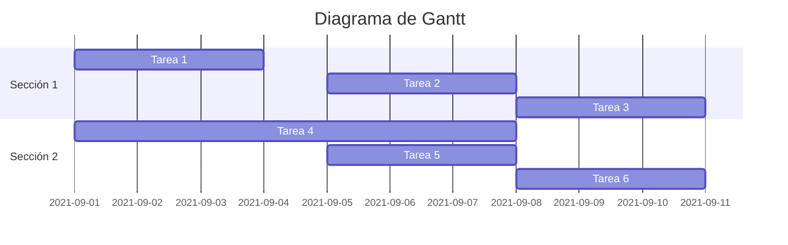
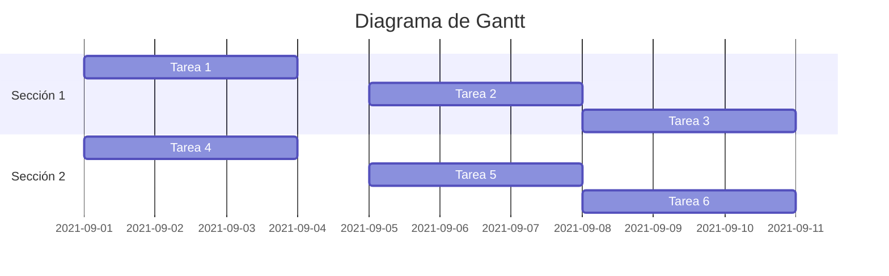
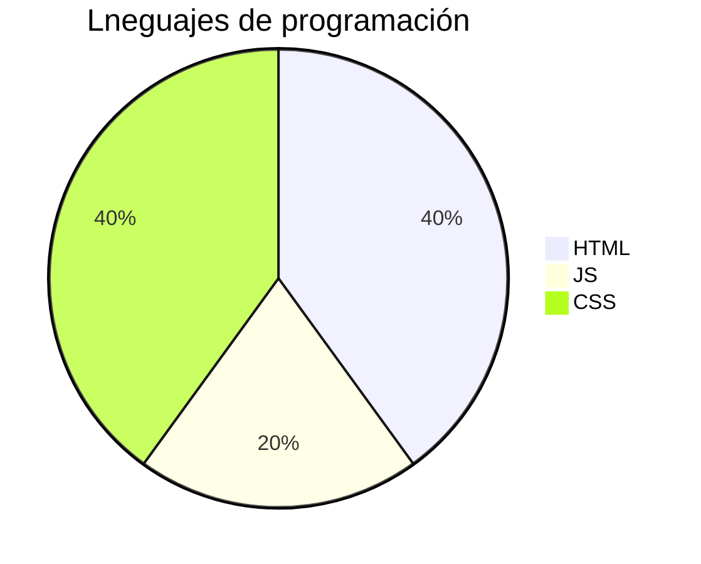
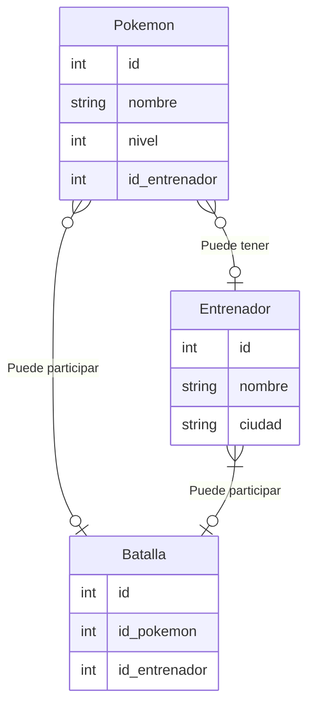
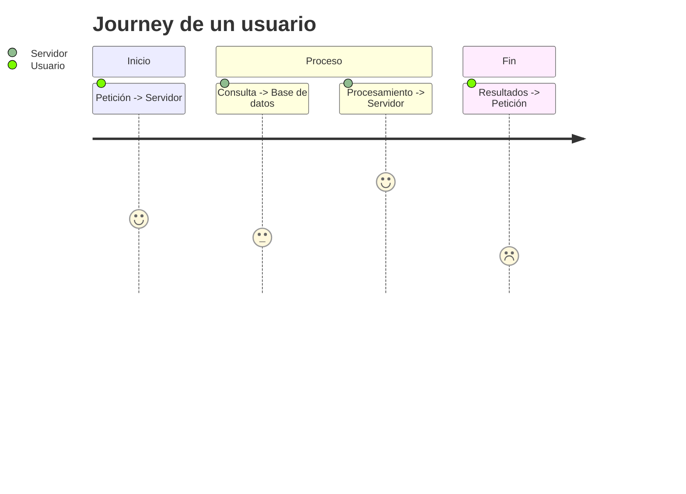

# Markdown

<!--toc:start-->
- [Que es Markdown](#que-es-markdown)
- [Sintaxis](#sintaxis)
  - [Titulos](#titulos)
  - [Negrita](#negrita)
  - [Cursiva](#cursiva)
  - [Texto tachado](#texto-tachado)
  - [Texto subrayado](#texto-subrayado)
  - [Lista desordenada](#lista-desordenada)
  - [Lista ordenada](#lista-ordenada)
  - [Enlace](#enlace)
  - [Cita](#cita)
  - [Linea separadora](#linea-separadora)
  - [Código de programación](#código-de-programación)
  - [Tabla](#tabla)
  - [Imagen](#imagen)
  - [Video](#video)
  - [Notas al pie](#notas-al-pie)
  - [Diagramas](#diagramas)
    - [Diagrama de flujo](#diagrama-de-flujo)
    - [Diagrama de clases](#diagrama-de-clases)
    - [Diagrama de secuencia](#diagrama-de-secuencia)
    - [Diagrama de Gantt](#diagrama-de-gantt)
    - [Diagrama circular](#diagrama-circular)
    - [Diagrama de entidad-relación](#diagrama-de-entidad-relación)
    - [Diagrama de Journey](#diagrama-de-journey)
    - [Diagrama de Git](#diagrama-de-git)
  - [Lenguaje matematico](#lenguaje-matematico)
  - [Tareas](#tareas)
  - [Menciones](#menciones)
  - [Emojis](#emojis)
  - [Badges](#badges)
- [Markdown con HTML](#markdown-con-html)
  - [Estilos de texto](#estilos-de-texto)
  - [Imagen con HTML](#imagen-con-html)
  - [Video con HTML](#video-con-html)
<!--toc:end-->

## Que es Markdown

Es un lenguaje de marcado ligero creado por John Gruber que trata de conseguir la máxima legibilidad y facilidad de publicación tanto en su forma de entrada como de salida, inspirándose en muchas convenciones existentes para marcar mensajes de correo electrónico usando texto plano.

## Sintaxis

<!-- Comentario --->

### Titulos

```Markdown
- # H1
- ## H2
- ### H3
- #### H4
- ##### H5
- ###### H6
```

### Negrita

- Es es un ejemplo de texto en **Negrita**
- Este es un ejemplo de texto en **Negrita**

```Markdown
**Negrita**
__Negrita__
```

### Cursiva

- Este es un ejemplo de texto en *Cursiva*
- Este es un ejemplo de texto en *Cursiva*

```Markdown
*Cursiva*
_Cursiva_
```

### Texto tachado

- Este es un ejemplo de ~~texto tachado~~

```Markdown
~~Texto tachado~~
```

### Texto subrayado

- Este es un ejemplo de <ins>texto subrayado</ins>
- Este es un ejemplo de <u>texto subrayado</u>

```markdown
<ins>Texto subrayado</ins>
<u>Texto subrayado</u>
```

### Lista desordenada

- Ejemplo de una opción
  - Ejmeplo de una subopción
    - Ejemplo de una subopción

```Markdown
* Opción 1
  * Ejmeplo de una subopción
    * Ejemplo de una subopción
* Opción 2
* Opción 3
```

### Lista ordenada

1. Ejemplo de una opción
   1. Ejemplo de una subopción
      1. Ejemplo de una subopción

```Markdown
1. Opción 1
   1. Ejemplo de una subopción
      1. Ejemplo de una subopción
2. Opción 2
3. Opción 3
```

### Enlace

- Ejemplo de un [enlace](https://www.google.com "Google")

```Markdown
[enlace](https://www.google.com "Decripcion del enlace")
```

### Cita

> Estes es un ejemplo de una cita

```Markdown
> Cita
```

### Linea separadora

---

```Markdown
<!--Guión medio-->

---

<!--Guión bajo-->

___
```

### Código de programación

```Java
public class Main {
  public static void main(String[] args) {
    System.out.println("Ejemplo de implemetacion de código");
  }
}
```

```Markdown
<!-- Retirar los paréntesis -->

( ```Nombre del lenguaje
Código del lenguaje
``` )
```

### Tabla

| Izquierda | Mitad | Derecha |
| --------- | :---: | ------: |
| Item1.    | Item2 | Item3   |
| Item1.    | Item2 | Item3   |

```Markdown
<!-- Los elementos de cada columna se alineando acorde a la posición del caracter : -->

| Izquierda | Mitad | Derecha |
| --------- | :---: | -------:|
| Item1.    | Item2 | Item3   |
| Item1.    | Item2 | Item3   |
```

### Imagen



```markdown

```

### Video

[](https://www.youtube.com/watch?v=ysG76Vh4fUY)

```markdown
[](URL del video)
```

### Notas al pie

```markdown
Este es un ejemplo de una nota al pie[^1]

[^1]: Este es el contenido de la nota al pie
```

### Diagramas

#### Diagrama de flujo



```Markdown

- Usa diferentes orientaciones para los nodos con:
  - TD: Arriba hacía abajo
  - LR: Izquierda hacía derecha
  - RL: Derecha hacía izquierda
  - BT: Abajo hacía arriba

  ```mermaid
  graph LR
    A((Inicio de la batalla))
    B[/Selecciona Pokémon/]
    C[/Selecciona movimiento/]
    D[/Movimiento del oponente/]
    E[/Calcula daño/]
    F{Pokemón debilitado?}
    I[/Cambia de Pokémon/]
    J{Cambiar de Pokémon?}

    A --> B --> C --> D --> E --> F
    F -->|Sí| B
    F -->|No| J
    J -->|Sí| I -->C
    J -->|No| C
```

#### Diagrama de arbol

```plaintext
src
│
└───lt
│   └───nameApp
│       └───Main.java
│
└───test
│   └───resources
│
└───build
```

#### Diagrama de clases



```Markdown


#### Diagrama de secuencia



```Markdown


#### Diagrama de Gantt



```Markdown


#### Diagrama circular



```Markdown


#### Diagrama de entidad-relación



```Markdown


#### Diagrama de Journey



```Markdown


#### Diagrama de Git


```Markdown


### Lenguaje matematico

$$ x = \frac{-b \pm \sqrt{b^2 - 4ac}}{2a} $$

```markdown
$$ x = \frac{-b \pm \sqrt{b^2 - 4ac}}{2a} $$
```

### Tareas

- [x] Tarea completada
- [ ] Tarea por completar

```Markdown
- [x] Tarea completada
- [ ] Tarea por completar
```

### Menciones

@lennynT02

```markdown
@usuario
```

### Emojis

:smile: :heart: :+1:

```Markdown
:smile: :heart: :+1:
```

### Badges

[](https://github.com)

```markdown
[](URL del enlace)
```

## Markdown con HTML

### Estilos de texto

<center>
  <p style="color: red; font-size: 14px; font-family: Arial; font-weight: bold;">
    Ejemplo de texto con diferentes estilos mediante HTML
  </p>
</center>

```HTML
<center>
  <p style="color: red; font-size: 20px; font-family: Arial; font-weight: bold;">
    Ejemplo de texto con diferentes estilos mediante HTML
  </p>
</center>
```

### Imagen con HTML


```Markdown

```

### Video con HTML

<iframe
  width="560"
  height="315"
  src="https://www.youtube.com/embed/ysG76Vh4fUY"
  title="Clases y Objetos"
  frameborder="0"
  allow="accelerometer; autoplay; clipboard-write; encrypted-media; gyroscope; picture-in-picture; web-share"
  referrerpolicy="strict-origin-when-cross-origin"
  allowfullscreen
>
</iframe>

```HTML
<iframe 
  width="560" 
  height="315" 
  src="URL del video" 
  title="Título del video" 
  frameborder="0" 
  allow="accelerometer; autoplay; clipboard-write; encrypted-media; gyroscope; picture-in-picture; web-share" 
  referrerpolicy="strict-origin-when-cross-origin" 
  allowfullscreen
>
</iframe>
```
