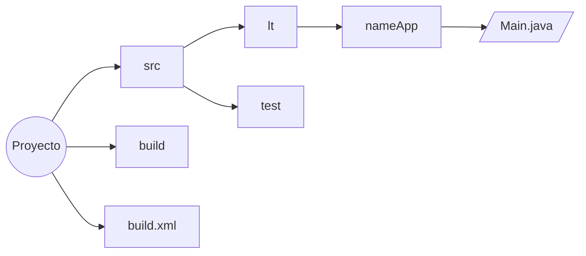
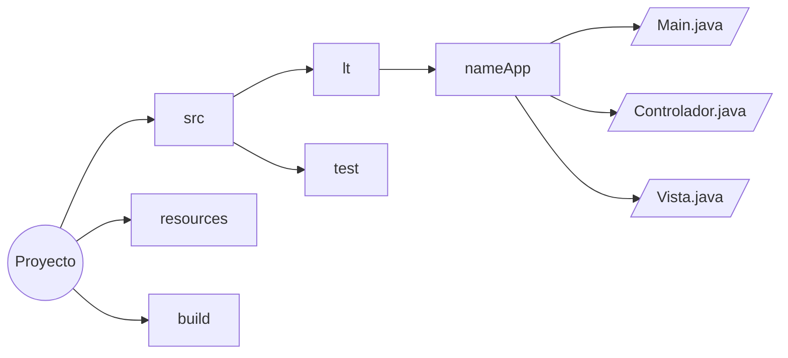

# Estructuras Java

<!--toc:start-->
- [Estructuras Java](#estructuras-java)
  - [Aplicación de Terminal](#aplicación-de-terminal)
  - [Aplicación GUI](#aplicación-gui)
  - [Desarrollo Web (Servlet/JSP)](#desarrollo-web-servletjsp)
  - [Desarrollo Web (Spring)](#desarrollo-web-spring)
  - [Desarrollo movil (Android)](#desarrollo-movil-android)
  - [Proyecto Maven/Gradle](#proyecto-mavengradle)
<!--toc:end-->

## Aplicación de Terminal



## Aplicación GUI



## Desarrollo Web (Servlet/JSP)

```mermaid
graph LR
  A((Proyecto))
  B[src]
  C[lt]
  D[nameApp]
  E[modelo]
  F[vista]
  G[controlador]
  H[test]
  I[web]
  J[build]
  K[/Main.java/]

  A --> B --> C --> D --> E
  D --> F
  D --> G
  D --> K
  B --> H
  A --> I
  A --> J
  ```

## Desarrollo Web (Spring)

```mermaid
graph LR
  A((Proyecto))
  B[src]
  C[lt]
  D[nameApp]
  E[modelo]
  F[servicio]
  G[controlador]
  H[test]
  I[web]
  J[build]
  L[repository]

  K[/Aplication.java/]

  A --> B --> C --> D --> E
  D --> F
  D --> G
  D --> K
  D --> L
  B --> H
  A --> I
  A --> J
  ```

## Desarrollo movil (Android)

```mermaid
graph LR
  A((Proyecto))
  B[src]
  C[lt]
  D[nameApp]
  E[actividades]
  F[fragmentos]
  G[servicios]
  H[test]
  I[assets]
  J[build]
  K[/MainActivity.java/]

  A --> B --> C --> D --> K
  D --> E
  D --> F
  D --> G
  B --> H
  A --> I
  A --> J
  ```

## Proyecto Maven/Gradle

```mermaid
graph LR
  A((Proyecto))
  B[src]
  C[lt]
  D[nameApp]
  E[test]
  F[resources]
  G[build]
  H[pom.xml/gradle.build]

  I[/Main.java/]

  A --> B --> C --> D --> I
  B --> E
  A --> F
  A --> G
  A --> H
  ```
