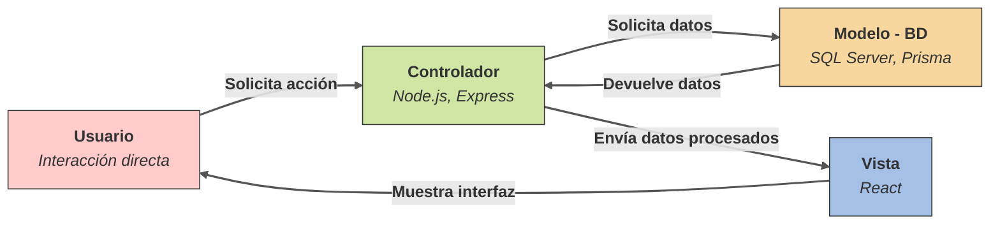

# Esquema MVC Th_Sistema

```mermaid

graph LR
    style A fill:#ffcccb,stroke:#333,stroke-width:1px
    style B fill:#d0e6a5,stroke:#333,stroke-width:1px
    style C fill:#a5c0e6,stroke:#333,stroke-width:1px
    style D fill:#f7d79e,stroke:#333,stroke-width:1px

    A[<strong>Usuario</strong><br><i>Interacción directa</i>]
    B[<strong>Controlador</strong><br><i>Node.js, Express</i>]
    C[<strong>Vista</strong><br><i>React</i>]
    D[<strong>Modelo - BD</strong><br><i>SQL Server, Prisma</i>]

    linkStyle default stroke-width:2px,stroke:#555,fill:none
    A -->|<strong>Solicita acción</strong>| B
    B -->|<strong>Solicita datos</strong>| D
    D -->|<strong>Devuelve datos</strong>| B
    B -->|<strong>Envía datos procesados</strong>| C
    C -->|<strong>Muestra interfaz</strong>| A
```
