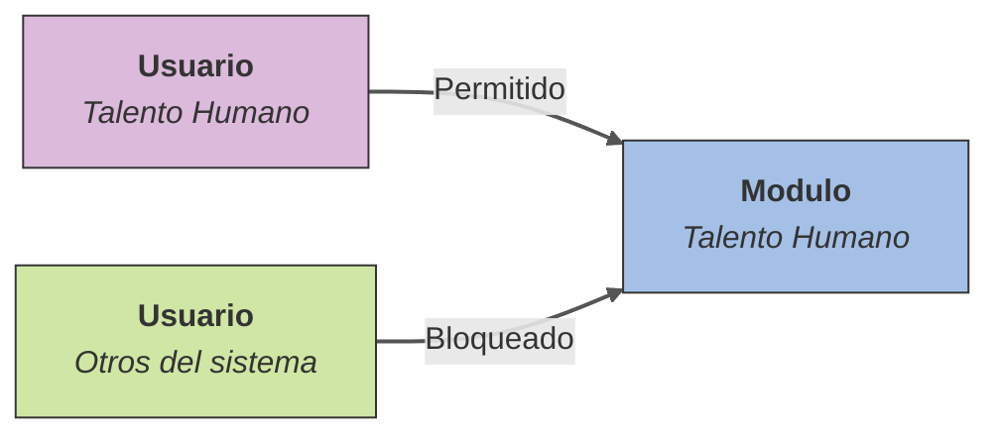

# esquema rol th sistema

```mermaid

graph LR
    style A fill:#dcbadb,stroke:#333,stroke-width:1px
    style B fill:#d0e6a5,stroke:#333,stroke-width:1px
    style C fill:#a5c0e6,stroke:#333,stroke-width:1px

    A[<strong>Usuario</strong><br><i>Talento Humano</i>]
    B[<strong>Usuario</strong><br><i>Otros del sistema</i>]
    C[<strong>Modulo</strong><br><i>Talento Humano</i>]

    linkStyle default stroke-width:2px,stroke:#555,fill:none
    A -->|Permitido| C
    B -->|Bloqueado| C
```
