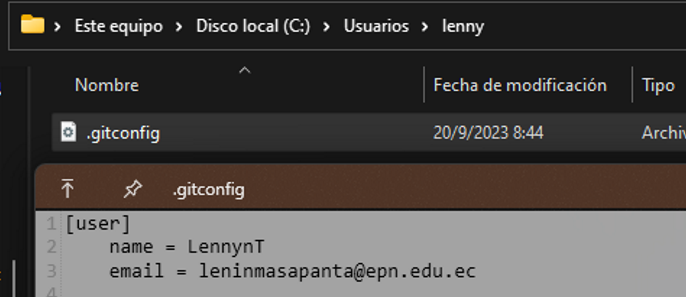

# Git

## Que es

Es un sistema de control de versiones que nos permite llevar un historial de
todos los cambios que exitan en un proyecto

## Instalación

Se puede descargar de varias fuentes como:

- Pagina oficial

  [Descarga Git aqui](https://git-scm.com/ "Pagina Oficial de Git")

- Comandos

  ```bash
  winget install Git.Git
  ```

Para verificar la instalación podemos ejecutar el siguiente comando

```bash
git -v
```

## Comandos Git

- Crear usuario

  ```bash
  git config --global user.name "Nomnre"
  git config --global user.email "Correo"
  ```

  

- Crear un control de versiones en un directorio

  ```bash
  git init
  ```

- Cambiar el nombre de la rama principal

  ```bash
  git branch -m main
  ```

- Estado de la rama

  ```bash
  git status
  ```

- Agregar a stash

  ```bash
  git add ejeplo.rs
  ```

- Realizar un commit

  ```bash
  git commit -m "Este es mi primer commit"
  ```

- Estado del commit

  ```bash
  git log
  ```

- Formas de ver el log de commits

  ```bash
  git log --graph

  git log --graph --pretty=oneline

  git log --graph --decorate --all --oneline
  ```

- Crear alias

Al crear un alias se guarda en el archivo de configuración de Git

```bash
git config --global alias.tree "log --graph --decorate --all --oneline"
```

- Mostrar todo el historial de commits

  ```bash
  git reflog
  ```

- Crear un Tag

  ```bash
  git tag ejemplo
  ```

- Agregar todos los archivos con cambios al stash

  ```bash
  git add .
  ```

- Cambiar la posición de un Tag en especifico

  ```bash
  git checkout tags/ejemplo
  ```

## Comando de ramas en Git

- Crear una nueva rama

  ```bash
  git branch rama
  ```

- Moverse entre ramas

  ```bash
  git switch rama
  ```

- Juntar una rama y todos sus cambios

  ```bash
  git merge main
  ```

- Eliminar una rama

  ```bash
  git branch -d rama
  ```

- Lista en stash

  ```bash
  git stash
  ```

- Agregar los cambios guardados en stash

  ```bash
  git stash pop
  ```

- Eliminar el contenido del stash

  ```bash
  git stash drop
  ```

Para mas comando e información sobre los comandos de Git puedes
ingresar [aqui](https://bit.ly/3VqDq5I "Cheat Sheet Git"), el siguiente tema sera [conexion con GitHub](/limbo/1756502611-git-y-github.md).
